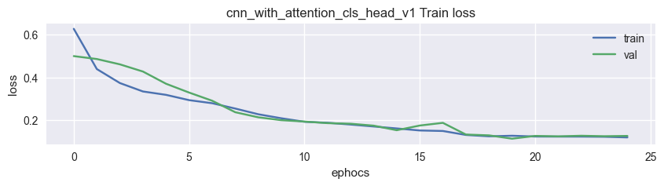

# MNIST Similarity Learning Project

This project implements a similarity learning framework for the MNIST dataset using various convolutional neural network (CNN) architectures with Siamese and Triplet loss functions. The goal is to learn meaningful feature embeddings for digit classification and evaluate their quality using silhouette scores and k-NN accuracy.

## Project Overview

The project processes the MNIST dataset, trains multiple CNN models with different architectures and loss functions, and evaluates their performance. The models include simple CNNs, attention-based CNNs, and Vision Transformer (ViT)-style architectures, trained using Siamese or Triplet loss, with some incorporating classification heads and L2 normalization.

## Steps Taken

### 1. Data Acquisition

- **Dataset**: Downloaded the MNIST dataset in CSV format from Kaggle (`oddrationale/mnist-in-csv`) using the `kagglehub` library.
- **Description**: The dataset contains 70,000 grayscale images of handwritten digits (0-9), each of size 28x28 pixels, split into 60,000 training and 10,000 test samples.
- **Process**:
  - Loaded `mnist_train.csv` and `mnist_test.csv` into pandas DataFrames.
  - Combined training and test sets into a single DataFrame for unified processing.
  - Extracted images (reshaped to 28x28x1) and labels (0-9) for further processing.

### 2. Data Exploration

- **Visualization**:
  - Displayed random samples of images (5 rows, 10 columns) with corresponding labels (e.g., "Zero", "One", ..., "Nine").
  - Plotted class distribution using a seaborn countplot to confirm balanced classes (approximately 7,000 samples per digit).
- **Output**: Images saved in the project directory (not explicitly saved to disk but displayed inline).

### 3. Data Preprocessing

- **Image Preprocessing**:
  - Resized images to 28x28 pixels (if needed).
  - Normalized pixel values to \[0, 1\] by dividing by 255.
  - Ensured images have a channel dimension (28x28x1).
  - Commented-out additional preprocessing (e.g., Gaussian blur, Sobel filters, Canny edge detection) to maintain simplicity.
- **Label Processing**:
  - Converted labels to lowercase strings and encoded them using `LabelEncoder` (10 classes: 0-9).
- **Data Splitting**:
  - Split data into training (60%), validation (20%), and test (20%) sets using `train_test_split` with a random state of 42.
  - Shapes:
    - Training: (42,000, 28, 28, 1)
    - Validation: (14,000, 28, 28, 1)
    - Test: (14,000, 28, 28, 1)

### 4. Data Generators

- **Custom Data Generators**:
  - Implemented three custom Keras `Sequence` generators for Siamese, Triplet, and Triplet with Classification (CLS) head training:
    - **Siamese Pair Generator**: Generates pairs of images (positive: same class, negative: different class) with labels (1 for similar, 0 for dissimilar).
    - **Triplet Generator**: Generates triplets (anchor, positive, negative) for triplet loss training.
    - **Triplet CLS Generator**: Similar to Triplet but includes anchor class labels for classification head.
  - Features:
    - Optional data augmentation (commented out: horizontal/vertical flips, rotation, crop, brightness/contrast adjustments, Gaussian noise).
    - Feature-space sampling for negative pairs/triplets using precomputed embeddings (if a feature extractor is provided).
    - Parallel loading with `ThreadPoolExecutor` for efficiency.
  - Visualized sample pairs/triplets to verify generator correctness.

- ***Pos/Neg Pairs***
  - 
  - 
- ***Anchor Pos Neq Triplet***
  - 
- ***Anchor Pos Neq Triplet with CLS head***
  - 

### 5. Model Architectures

Six models were designed and trained, each with a unique architecture and loss function:

1. **cnn_simple_v1**:
   - **Architecture**: Simple CNN (Conv2D → AvgPool2D → Conv2D → AvgPool2D → Flatten).
   - **Loss**: Siamese contrastive loss (margin=10.0).
   - **Training**: Siamese pairs (positive/negative).
2. **cnn_simple_v2**:
   - **Architecture**: Similar to `cnn_simple_v1` but with larger filters (128, 256) and ELU activation.
   - **Loss**: Triplet loss (margin=10.0).
   - **Training**: Triplet (anchor, positive, negative).
3. **cnn_with_attention_v1**:
   - **Architecture**: CNN with CBAM (Convolutional Block Attention Module: SE block + spatial attention).
   - **Loss**: Triplet loss (margin=10.0).
   - **Training**: Triplet.
4. **cnn_with_attention_cls_head_v1**:
   - **Architecture**: CNN with CLS token, positional encoding, and multi-head attention (ViT-inspired), plus a classification head.
   - **Loss**: Combined triplet loss with L2 normalization (margin=1.0) and sparse categorical crossentropy (weights: 0.5, 1.0).
   - **Training**: Triplet with CLS head.
5. **cnn_with_attention_cls_head_v2**:
   - **Architecture**: Similar to `cnn_with_attention_cls_head_v1` with modified triplet loss.
   - **Loss**: Triplet loss with L2 normalization, center regularization (margin=1.5, center_reg_weight=0.05), and sparse categorical crossentropy (weights: 1.0, 1.0).
   - **Training**: Triplet with CLS head.
6. **cnn_with_attention_vit_style_v1**:
   - **Architecture**: ViT-style with CLS token, positional encoding, and two multi-head attention blocks.
   - **Loss**: Contrastive loss (margin=10.0).
   - **Training**: Siamese pairs.

- **Implementation**:
  - Used Keras Functional and Sequential APIs.
  - Custom loss functions: `contrastive_loss`, `triplet_loss`, `triplet_loss_l2_norm`, `triplet_loss_l2_norm_safe`.
  - Saved model weights and history in `models_cache/` directory.
  - Visualized model architectures (saved as `<model_name>_arch.png` in `models_cache/`).

- 
- 
- 
- 
- 
- 

### 6. Training

- **Setup**:
  - Epochs: 50
  - Batch size: 256
  - Callbacks: EarlyStopping (patience=11), ModelCheckpoint (save best weights), ReduceLROnPlateau (factor=0.1, patience=3), custom `HistoryCheckpoint` for history logging.
- **Process**:
  - Trained each model using its respective data generator (`train_siamese_generator`, `train_triplet_generator`, or `train_triplet_cls_generator`).
  - Validated on corresponding validation generators.
  - Cached weights and history to avoid retraining unless forced.

### 7. Evaluation

- **Metrics**:
  - **Silhouette Score**: Measured clustering quality of test embeddings using Euclidean distance.
  - **3-NN Accuracy**: Trained a 3-nearest neighbors classifier on training embeddings and evaluated on test embeddings.
  - 
- **Results** (saved to `model_evaluation.csv`):
  - **cnn_simple_v2**: Silhouette=0.1554, 3-NN Accuracy=0.9779 (Triplet, Margin=10.0)
  - **cnn_simple_v1**: Silhouette=0.0991, 3-NN Accuracy=0.9614 (Siamese, Margin=10.0)
  - **cnn_with_attention_v1**: Silhouette=0.0534, 3-NN Accuracy=0.7484 (Triplet, Margin=10.0)
  - **cnn_with_attention_vit_style_v1**: Silhouette=-0.0521, 3-NN Accuracy=0.4356 (Contrastive, Margin=10.0)
  - **cnn_with_attention_cls_head_v1**: Silhouette=-0.0825, 3-NN Accuracy=0.3355 (Triplet with CLS Head, Margin=1.0, L2 Norm)
  - **cnn_with_attention_cls_head_v2**: Silhouette=-0.1211, 3-NN Accuracy=0.3704 (Triplet with CLS Head, Margin=1.5, L2 Norm, Center)
- **Analysis**:
  - Simple CNNs (`cnn_simple_v2`, `cnn_simple_v1`) outperformed attention-based models in both metrics.
  - Triplet loss generally performed better than contrastive loss or combined triplet+classification loss.
  - Attention-based models with CLS heads underperformed, possibly due to complexity or insufficient tuning.

### 8. Visualization

- **Training Curves**:
  - Plotted training and validation loss for each model individually and collectively.
  - Paths: Inline plots (not saved to disk).
    
  - 
  - 
  - 
  - 
  - 
  - 
  - 
  - 

- **Latent Space Visualization**:
  - Used UMAP to reduce test embeddings (first 1,000 samples) to 2D.
  - Plotted scatter plots with class labels, saved as `latent_space/<model_name> latent space.png`.
  - 
  - 
  - 
  - 
  - 
  - 

- **Intermediate Features and Kernels**:
  - Visualized Conv2D layer outputs for a random input image (Trials 1-3).
  - Paths: `models_explain/Trial <1,2,3>/<model_name>/kernel no <i> Output.png`
  - Visualized Conv2D kernel weights for each model.
  - Paths: `models_explain/Intermediate Kernels/<model_name>/layer no <i> kernel weights.png`

### 9. Model Explanation

- **Intermediate Features**:
  - Extracted Conv2D layer outputs for a single input image using a submodel.
  - Visualized feature maps as grids (16 columns, resized 15x) with Viridis colormap.
  - 
  - 
  - 
- **Kernel Visualization**:
  - Used gradient ascent to visualize the input that maximizes activation for each Conv2D filter.
  - Saved as grids with Viridis colormap.
  - 

## Directory Structure

- `models_cache/`:
  - Model weights: `<model_name>.weights.h5`
  - Feature extractor weights: `<model_name>.feature_extractor.weights.h5`
  - History: `<model_name>.history.json`
  - Architecture diagrams: `<model_name>_arch.png`
- `latent_space/`:
  - UMAP visualizations: `<model_name> latent space.png`
- `models_explain/`:
  - `Trial <1,2,3>/`:
    - Input image: `input_image.png`
    - Feature maps: `<model_name>/kernel no <i> Output.png`
  - `Intermediate Kernels/`:
    - Kernel weights: `<model_name>/layer no <i> kernel weights.png`
- `model_evaluation.csv`: Evaluation results (Silhouette Score, 3-NN Accuracy).

## Dependencies

- Python libraries: `numpy`, `pandas`, `matplotlib`, `seaborn`, `umap-learn`, `kagglehub`, `opencv-python`, `tensorflow`, `scikit-learn`, `tqdm`.
- TensorFlow/Keras for model building and training.
- UMAP for latent space visualization.

## How to Run

1. Install dependencies: `pip install numpy pandas matplotlib seaborn umap-learn kagglehub opencv-python tensorflow scikit-learn tqdm`
2. Set `BASE_DIR` to the desired project directory (default: current directory).
3. Run the script to download the dataset, preprocess data, train models, and generate visualizations.
4. Check `models_cache/`, `latent_space/`, and `models_explain/` for outputs.

## Future Improvements

- Tune hyperparameters (e.g., margins, loss weights, learning rates) for attention-based models.
- Explore additional data augmentation techniques to improve robustness.
- Increase training epochs or adjust early stopping patience for better convergence.

Investigate why CLS head models underperformed (e.g., loss weighting, architecture complexity).